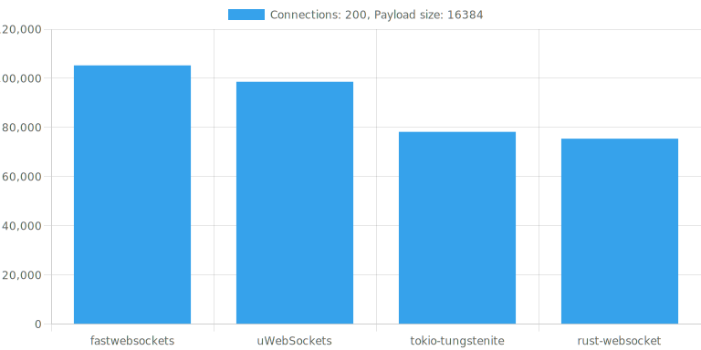
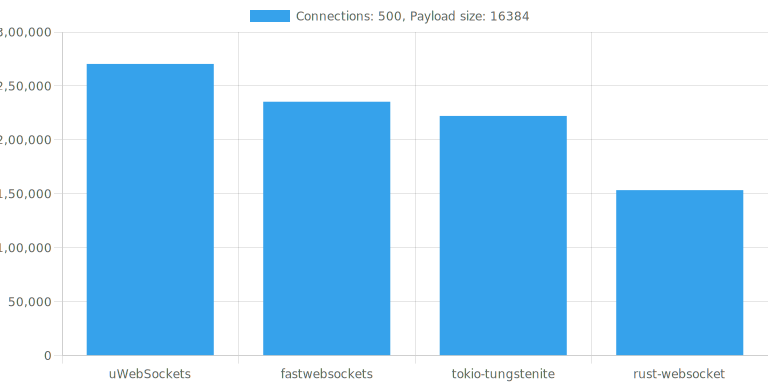

### Plaintext, echo WebSocket server benchmark






Y-axis is number of messages sent per sec. (size per message = payload size)

```
Linux divy 5.19.0-1022-gcp #24~22.04.1-Ubuntu SMP x86_64 GNU/Linux

32GiB System memory
Intel(R) Xeon(R) CPU @ 3.10GHz

fastwebsockets 0.4.2
rust-websocket 0.26.5
uWebSockets (main d043038)
tokio-tungstenite 0.18.0
```
