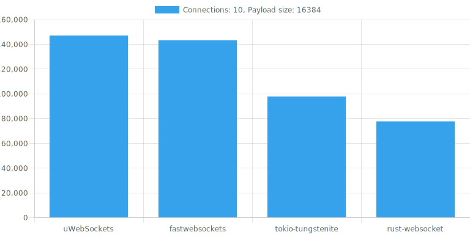
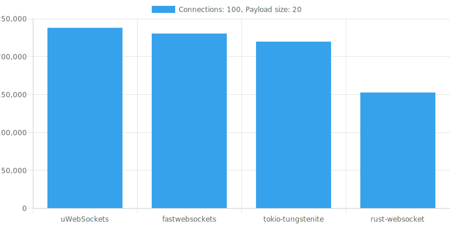

### Plaintext, echo WebSocket server benchmark






```
Linux divy 5.19.0-1022-gcp #24~22.04.1-Ubuntu SMP x86_64 GNU/Linux

32GiB System memory
Intel(R) Xeon(R) CPU @ 3.10GHz
```

### Plaintext, in-memory stream benchmark

https://github.com/nurmohammed840/web-socket-benchmark
